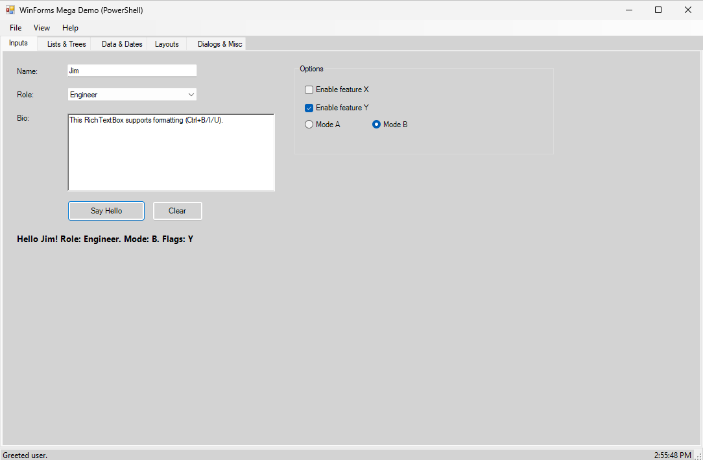
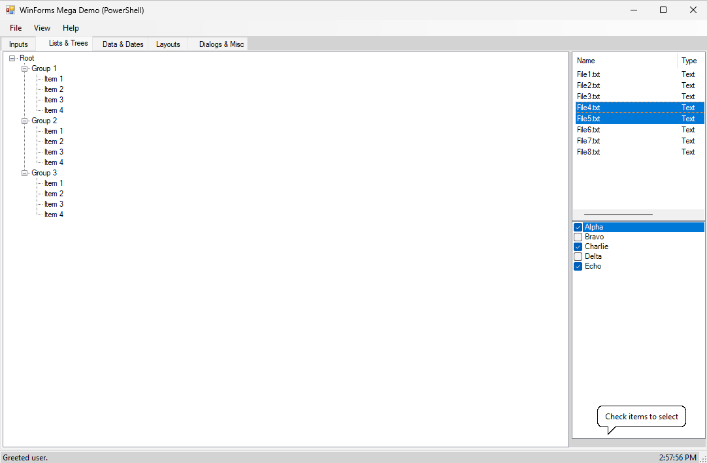
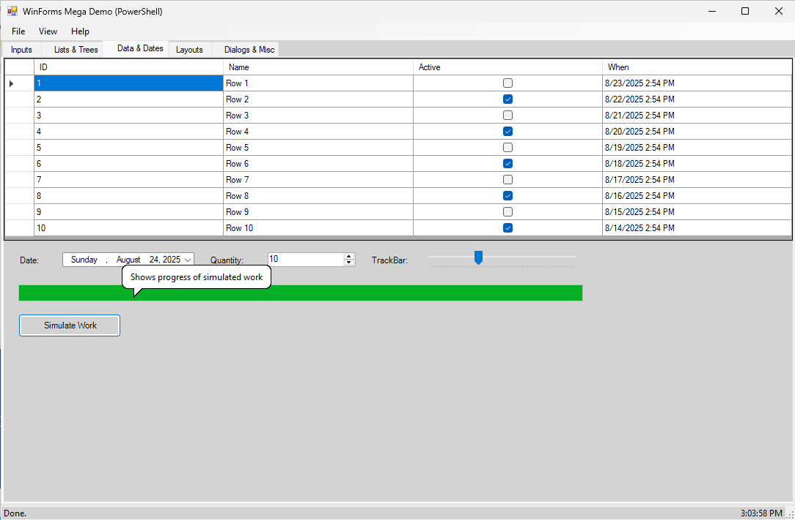
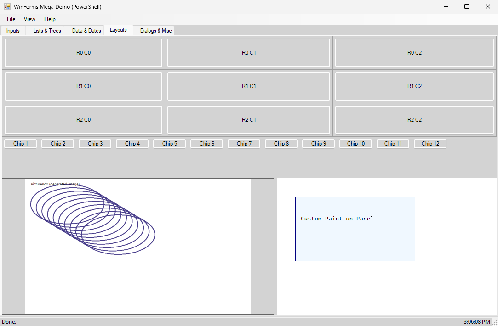
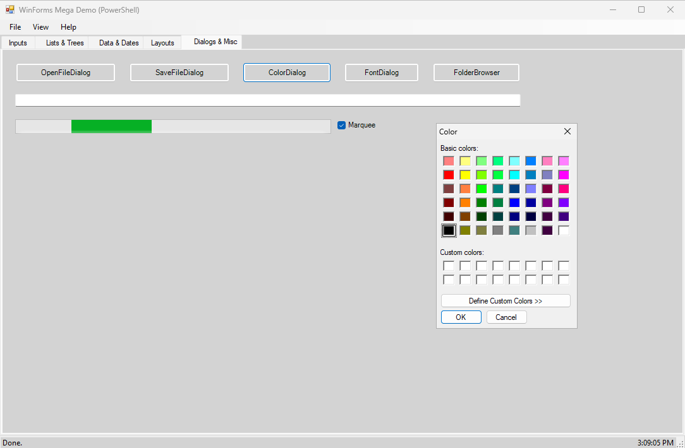

# WinForms Mega Demo (PowerShell)

This project is a **Windows Forms demo built in PowerShell**. It showcases many common WinForms controls and layouts, organized into tabs, and demonstrates how to wire up events, tooltips, menus, and dialogs.

---

## Features

### General

* Full WinForms form created in PowerShell.
* MenuStrip with **File, View, and Help** menus.
* StatusStrip with **Ready indicator, time clock, and dynamic updates**.
* ToolTips configured with balloon style, custom delays, and applied to controls.

### Tab 1: Inputs

* Labels, TextBoxes, ComboBox, and RichTextBox.
* GroupBox with CheckBoxes and RadioButtons (with tooltips).
* Buttons to **Say Hello** and **Clear** inputs.
* Output label displays greeting message based on inputs.



### Tab 2: Lists & Trees

* TreeView with nested nodes.
* ListView with columns (Name, Type, Size).
* CheckedListBox with multiple items.
* Context menu on ListView for **Select All** and **Invert Selection**.



### Tab 3: Data & Dates

* DataGridView bound to a sample DataTable (ID, Name, Active, Date).
* DateTimePicker, NumericUpDown, TrackBar.
* ProgressBar with simulated work demo.



### Tab 4: Layouts

* TableLayoutPanel (grid of buttons).
* FlowLayoutPanel (auto-wrapping button chips).
* SplitContainer with:

  * **Left:** PictureBox (auto-scaled generated image).
  * **Right:** Custom-painted Panel with scroll support.
* Responsive proportional splitter that resizes cleanly.



### Tab 5: Dialogs & Misc

* Buttons to open common dialogs: OpenFileDialog, SaveFileDialog, ColorDialog, FontDialog, FolderBrowserDialog.
* TextBox displays selected values from dialogs.
* NotifyIcon with balloon tips.
* ProgressBar with toggle between marquee and continuous mode.
* Timer updating clock in the status bar.



---

## Requirements

* Windows PowerShell 5.1 or PowerShell 7+ (Windows only).
* .NET Framework (for WinForms).

---

## Running the Demo

1. Clone or download this repository.
2. Run the script in PowerShell:

   ```powershell
   ./demo-forms.ps1
   ```
3. Interact with the tabs, menus, and controls.

---

## Notes

* Script demonstrates **many WinForms controls**, but is not exhaustive.
* Useful for learning how to:

  * Create controls dynamically in PowerShell.
  * Set properties like size, layout, docking.
  * Handle events such as button clicks, value changes, and paint events.
  * Organize UI with containers (Tabs, Panels, SplitContainers).
* Serves as a **reference or starting point** for your own PowerShell GUIs.

---

## License

This demo is provided as-is for educational purposes. Feel free to reuse and adapt it for your own projects.