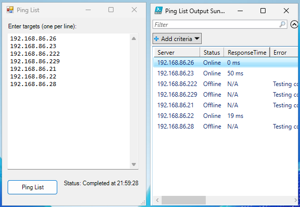

# Ping List

This is a very simple Forms example. The window has a textarea where the user can enter a list of targets to ping. Clicking the Ping List button will execute the ping on the targets. A gridview shows the results.

Possible improvements could include...
* DNS lookup handling
* The ability to test ports
* A text file input
* A CSV output

